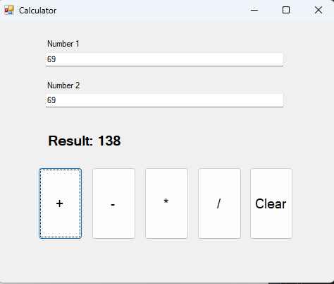
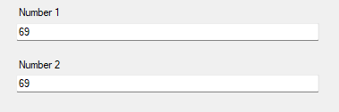
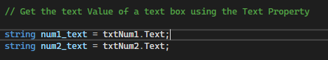
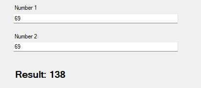
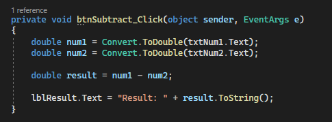

# App Dev Reviewer Prelim

* Understaning Controls By Creating a simple Calculator App :
  * Textboxes 
  * Buttons 
  * Labels
  * Conversion Methods

Example Output:



## Textboxes

These are controls used for user inputs




* The syntax to get the value of the textbox is to call the Text Property of the TextBox class

Ex:
``` c#

string textBoxValue = textBoxName.Text;

```

Ex code:



> Note: That the Text Property returns a String. So, if the textBox holds a number in a string data type, you need to convert it to get the number representation (int or double) of that string number.

* To clear the text value of a textbox you just need to call the `Clear()` function

Ex:
``` c#
txtBoxName.Clear();
```

## Labels

* This is a control for labeling something
* Purely text



> The labels in this image are "`Number 1`", "`Number 2`", "`Result: n`" 

* The only thing we do in labels is to statically set it a default value or to dynamically change it througout the runtime of the application

- The syntax to change the value of the text at runtime is:
``` c#
labelName.Text = "newTextValue";
```

> Note: Once again, the Text property returns a String so it also must **receive a String**.

- So, if the you want to pass a value that is a number (int or double), you must convert it to string first using the ToString() functiom.

EX:

``` c#

string numericValue = 69;
labelName.Text = numericValue.ToString();

```

## Buttons

* These are controls mostly used when we want to do something in our application (i.e clicking a button to add, subtract, etc.)

* To have a button to do something, you must have a reference to its click_event
    >kaya kung dino-double click nyo yung buttons, may ``name_Click()`` na nakalagay

Ex code of click event of buttons:


> This is an example of a click event of a button named `btnSubtract`. And whatever is inside that event will be executed whenever the button is clicked.


## Conversion

Before knowing how to convert data, you must know all the data types. In c#, we have a number of primitive data types:

### **32 Bits** Numeric Data types 
1. **int** - these are whole numbers ranging from -2^32-1 to + 2^32-1
   1. E.g. 1, 2, 3 ,4
2. **float** - these are floating point numbers (decimal numbers) ranging from also from -2^32-1 to + 2^32-1
   1. E.g. 3.14, 69.99999, 420.33
>Note: in c# float, you need to add the char "f" every after the decimal number (e.g. 3.14f)

### **64 Bits** Numeric Data types
3. **long** - these are integers but ranges from -2^64-1 to +2^64-1 
4. **double** - these are floats but ranges from -2^64-1 to +2^64-1  
  > you do not need to add the char "f" in every after the decimal number


#### **Other Data types**
5. **char** - this data type only holds a single character. And uses single quotation (eg. 'a')
6. **string** - this data type is a sequence of char (e.g. 'hitler')
7. **bool** - this data type only holds two values, True or False and is used in conditions.


Now, to convert from one data type to another, c# offers multiple ways to achieve this:

1. Using the Convert method 
2. Using the Parse Method
   

### Convert Method

The syntax for this type of conversion is:

```
Convert.DataType(valueToConvert);
```

Ex (converting a numeric string to double):

``` c#
double num1 = Convert.ToDouble(num1_text);
double num2 = Convert.ToDouble(num2_text);
```


## Parse Method

The syntax for this type of conversion is:

``` 
dataType.Parse(valueToConvert);
```

Ex (converting a numeric to double)
``` c#
double num1 = double.Parse(txtNum1.Text);
double num2 = double.Parse(txtNum2.Text);
```


